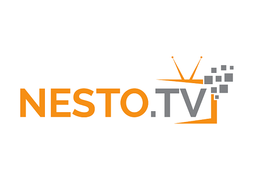

# Deep Learning for Time Series Forecasting

### Overview
Predict the Future with MLPs, CNNs and LSTMs in Python

### Description
Welcome to Deep Learning for Time Series Forecasting. Deep learning methods, such as
Multilayer Perceptrons, Convolutional Neural Networks, and Long Short-Term Memory Networks,
can be used to automatically learn the temporal dependence structures for challenging time
series forecasting problems. Neural networks may not be the best solution for all time series
forecasting problems, but for those problems where classical methods fail and machine learning
methods require elaborate feature engineering, deep learning methods can be used with great
success. This book was designed to teach you, step-by-step, how to develop deep learning
methods for time series forecasting with concrete and executable examples in Python.

### Labs

Labs for this course are available at path shared below. Elev8ed Notebooks (powered by Jupyter) will be accessible at the port given to you by your instructor. 

1. ##### How to Prepare Time Series Data for CNNs and LSTMs
		* <host-ip>:<port>/lab/workspaces/
2. ##### How to Develop MLPs for Time Series Forecasting (Part 1)
		* <host-ip>:<port>/lab/workspaces/
3. ##### How to Develop MLPs for Time Series Forecasting (Part 2)
		* <host-ip>:<port>/lab/workspaces/
4. ##### How to Develop CNNs for Time Series Forecasting (Part 1)
		* <host-ip>:<port>/lab/workspaces/
5. ##### How to Develop CNNs for Time Series Forecasting (Part 2)
		* <host-ip>:<port>/lab/workspaces/
6. ##### How to Develop LSTMs for Time Series Forecasting (Part 1)
		* <host-ip>:<port>/lab/workspaces/
7. ##### How to Develop LSTMs for Time Series Forecasting (Part 2)
		* <host-ip>:<port>/lab/workspaces/
8. ##### How to Develop Simple Methods for Univariate Forecasting (Part 1)
		* <host-ip>:<port>/lab/workspaces/
9. ##### How to Develop Simple Methods for Univariate Forecasting (Part 2)
		* <host-ip>:<port>/lab/workspaces/
10. ##### How to Develop ETS Models for Univariate Forecasting
		* <host-ip>:<port>/lab/workspaces/
11. ##### How to Develop SARIMA Models for Univariate Forecasting
		* <host-ip>:<port>/lab/workspaces/
12. ##### How to Develop MLPs, CNNs and LSTMs for Univariate Forecasting
		* <host-ip>:<port>/lab/workspaces/
13. ##### How to Grid Search Deep Learning Models for Univariate Forecasting
		* <host-ip>:<port>/lab/workspaces/
14. ##### How to Load and Explore Household Energy Usage Data
		* <host-ip>:<port>/lab/workspaces/
15. ##### How to Develop Naive Models for Multi-step Energy Usage Forecasting
		* <host-ip>:<port>/lab/workspaces/
16. ##### How to Develop ARIMA Models for Multi-step Energy Usage Forecasting
		* <host-ip>:<port>/lab/workspaces/
17. ##### How to Develop CNNs for Multi-step Energy Usage Forecasting
		* <host-ip>:<port>/lab/workspaces/
18. ##### How to Develop LSTMs for Multi-step Energy Usage Forecasting
		* <host-ip>:<port>/lab/workspaces/
19. ##### How to Load and Explore Human Activity Data
		* <host-ip>:<port>/lab/workspaces/
20. ##### How to Develop ML Models for Human Activity Recognition
		* <host-ip>:<port>/lab/workspaces/
21. ##### How to Develop CNNs for Human Activity Recognition
		* <host-ip>:<port>/lab/workspaces/
22. ##### How to Develop LSTMs for Human Activity Recognition
		* <host-ip>:<port>/lab/workspaces/
23. ##### Install Deep Learning Libraries
		* <host-ip>:<port>/lab/workspaces/lab19_Setup
24. ##### How to Setup Amazon EC2 for Deep Learning on GPUs
		* <host-ip>:<port>/lab/workspaces/lab20_AWS
